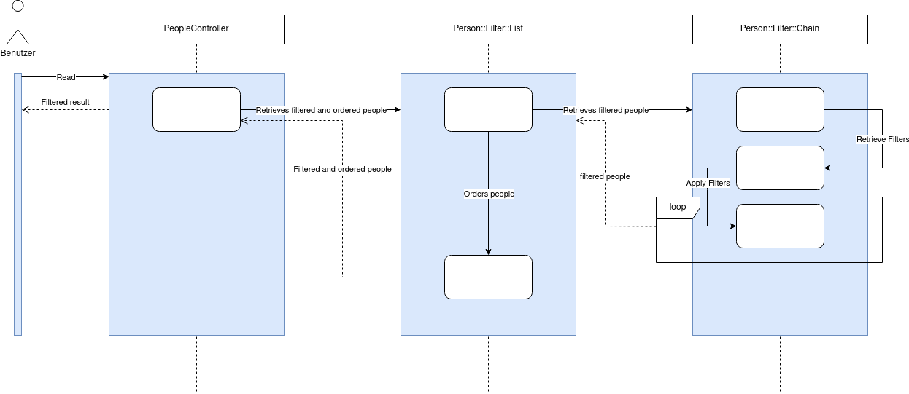
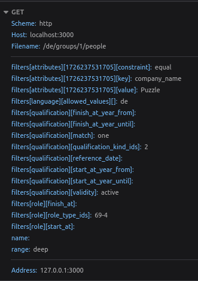

# Personenfilter Funktionalität

*Sequenzdiagramm des Personenfilters*

## Beschreibung

Der Personenfilter setzt sich aus drei Klassen zusammen:

- PeopleController
- Person::Filter::List
- Person::Filter::Chain

 Klasse                | Beschreibung                                                                                                                                               |
-----------------------|------------------------------------------------------------------------------------------------------------------------------------------------------------|
 PeopleController      | Der PeopleController nimmt den Request des Benutzers entgegen und erwidert die gefilterten und sortierten Personen auf welche der Benutzer zugreifen darf. |
 Person::Filter::List  | Personen auf welche der Benutzer keinen Zugriff hat werden rausgefiltert und anschliessend sortiert.                                                       |
 Perosn::Filter::Chain | Definiert anhand der Request Params vom Controller die Filter und wendet diese in einem Loop via chain-pattern an.                                         |

## Request
Ein Request auf den `PeopleController` entspricht folgendem Muster:

Attribute nach denen gefiltert wurde befinden sich in der URL und können somit einem anderen Benutzer weitergeleitet werden.

## Response
Die Response welche wir vom Controller erhalten kommt direkt als HTML:

