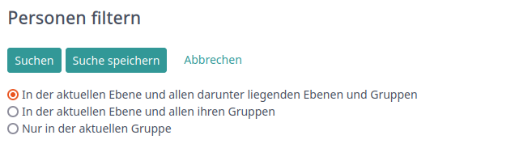
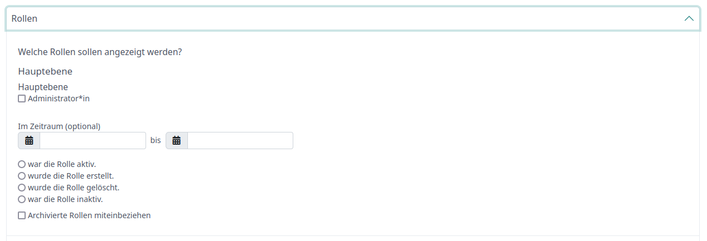
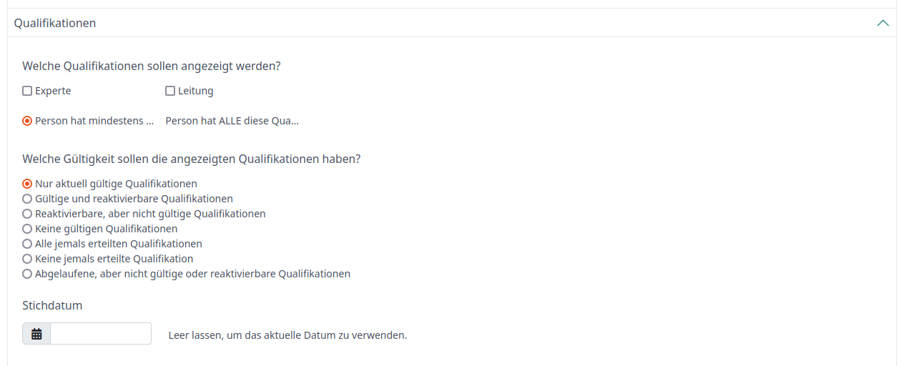
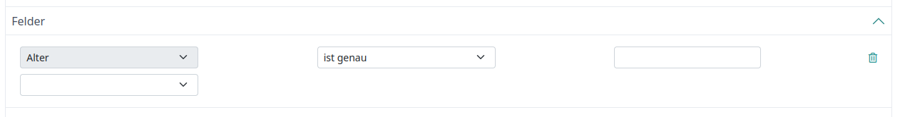
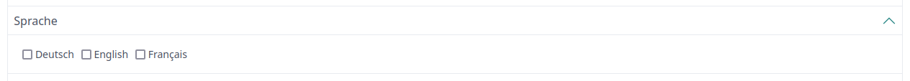
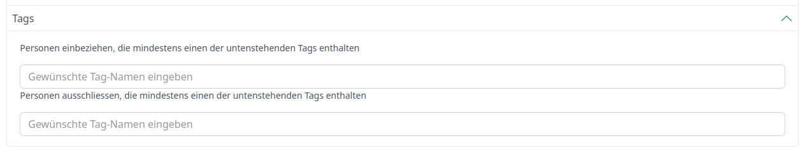
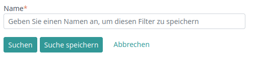

# Fachlich
In diesem Abschnitt wird der fachliche Zustand des Personenfilters aufgenommen werden.

## Suchkriterien

### Suchebene
Mit dem Filterkriterium "Suchebene" kann der Datenpool definiert werden, in welche unsere Suche
die Resultate filtert. Hier haben wir drei Auswahlsmöglichkeiten:

1. Top-Down: Der Datenpool umfasst die aktuelle Gruppe und alle darunterliegenden
2. Top-Group: Der Datenpool umfasst die aktuelle Ebene und alle ihre Gruppen
3. Group: Der Datenpool umfasst die aktuelle Gruppe

<i>Layers selection in UI</i>

### Rollen
Beim Filterkriterium "Rollen" kann definiert werden welche Rollen welche dazügehörige Gültigkeit
die Personen aufweisen müssen. Hitobito bietet dafür folgenden Möglichkeiten:

1. Rolle: Die Rollen werden pro Ebene (Hauptebene, Region/Kanton, etc.) aufgelistet und können vom User ausgewählt werden.
2. Zeitraum (optional): Der User kann auswählen in welchem Zeitraum die Rolle:
    - aktiv
    - erstellt
    - gelöscht
    - inaktiv
      ist.
3. Archivierte Rollen: Der User kan entscheiden ob archivierte Rollen im Datenpool miteinbezogen werden sollen.

<i>Roles selection in UI</i>

### Qualifikation
Durch das Filterkriterium "Qualifikation" schränken wir den Datenpool durch vom User ausgewählte Qualifikationen ein:

1. Qualifikationen: Es können Qualifikationen ausgewählt werden (Experte, Leitung, etc.).
2. Matcher: Der User kann bestimmen ob eine Person eine dieser Qualifikationen oder alle aufweisen muss um
   im Suchergebnis inkludiert zu werden.
3. Gültigkeit: Durch das Filterkriterium "Gültigkeit" kann der User auf eine Gültikeit an einem bestimmten Stichdatum
   filtern.

<i>Qualifications in UI</i>

### Felder
Das Filterkriterium "Felder" bietet dem User eine Vielzahl an Zusatzattribute für die Filterung an. Pro ausgewählten
Zusatzattribut erstellt Hitobito einen eigenen Filter. Zu diesen Zusatzattributen gehören:

- Alter
- Firmennamen
- Geburtstag
- Geschlecht
- Haupt-E-Mail
- Hausnummer
- Land
- Nachname
- Ort
- PLZ
- Postfach
- Strasse
- Vornamen
- Zusätzliche Adresszeile
- Übername

Bei allen Filtern kann zusätzlich zum Zahlen- oder Textwert eine Genauigkeit angegeben werden. Diese umfasst:

Das Zahlenwerten der Personen:
- genau
- grösser
- kleiner

als der angegebene Wert sein soll.

Das Textwerten der Personen:
- genau
- ungefähr
- nicht

dem angegebenen Wert entsprechen.

<i>Dynamic fields filter</i>

### Sprache
Durch das Filterkriterium "Sprache" definieren wir welche Sprache die Personen können müssen.
Wir bieten drei Sprachen aus Auswahlmöglichkeit an:
- Deutsch
- Englisch
- Französisch

<i>Language filter selection</i>

### Tags
Als letztes Filterkriterium bietet Hitobito die "Tags" an. Folgende Filtermöglichkeiten ergeben sich dadurch:
- Personen miteinbeziehen, welche mindestens eines der angegebenen Tags verfügen.
- Personen ausschliessen, welche mindestens eines der angegebenen Tags verfügen

<i>Tags filter selection</i>

## Speicherung
Für Wiederverwendungszwecke ist es dem Benutzer möglich den gesamten Filter zu speichern und anschliessend erneut
auszuführen.

<i>Option to save filter</i>

## Filter teilen
Der Filter kann einem anderen User übermittelt werden indem man den generierten Link aus der Leiste kopiert und
ihm diesen übermittelt.

