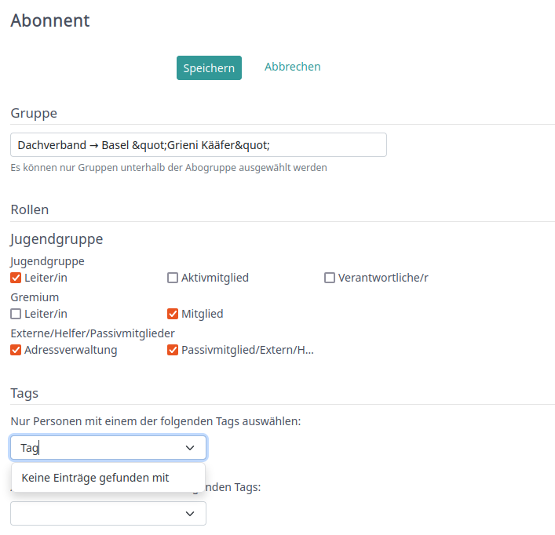
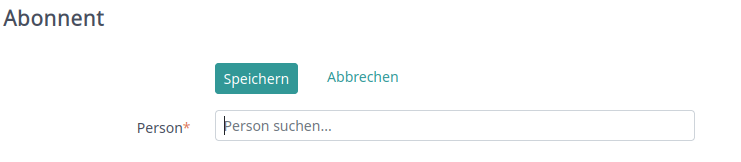
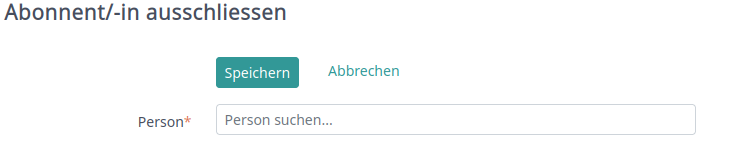
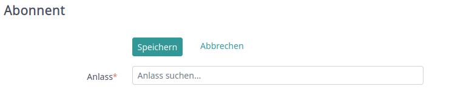
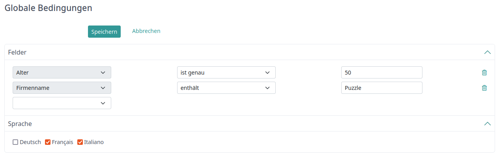

# People filter mailing list
In diesem Abschnitt wird der fachliche Zustand des people filter mailing list aufgenommen werden.

## Suchkriterien

### Gruppen & Rollen
Beim Filterkriterium "Gruppen & Rollen" kann definiert werden welche Gruppen und welche dazugehörige Rollen der User aufweisen muss.

1. Gruppe: Die Gruppe kann vom User via Typeahead definiert werden.
2. Rolle: Die Rollen werden pro Gruppe aufgelistet
3. Tags: Welche Tags die Personen aufweisen müssen

<i>Groups & Roles selection in UI</i>

### Personen (Auschluss, Einbezug)
Durch das Filterkriterium "Person" können einzelne Personen explizit über ein Dropdown ein- oder ausgeschlossen werden. 
Ausgeschlossene Personen werden unter einer eigenen Kategorie im UI angezeigt.

<i>Personen miteinbeziehen in UI</i>

---

<i>Personen ausschliessen in UI</i>

### Anlässe
Das Filterkriterium "Events" bietet dem User die Möglichkeit einzelne Events der Mailingliste zuzordnen,
dies über ein Typeahead Dropdown.

<i>Events in UI</i>

## Globale Bedingungen
Das Filterkriterium "Globale Bedingungen" bietet dem User eine Vielzahl an Zusatzattribute für die Filterung an.
Es ist deckungsgleich mit dem Suchkriteriium "Felder" des people list filter, für eine genauere
Erklärung bitte dessen [Beschrieb](people_list_filter.md#felder) konsultieren.

Zusätzlich zu den allgemeinen Attributen bietet dieser Filter die Möglichkeit zur Sprachauswahl an.

<i>Globale Filterung in UI</i>

## Speicherung
Für jedes der oben aufgezählten Suchkriterien wird von Hitobito eine eigene Editmaske bereitgestellt. 
Sobald der User diese speichert, wird die Filterung automatisch angepasst.
